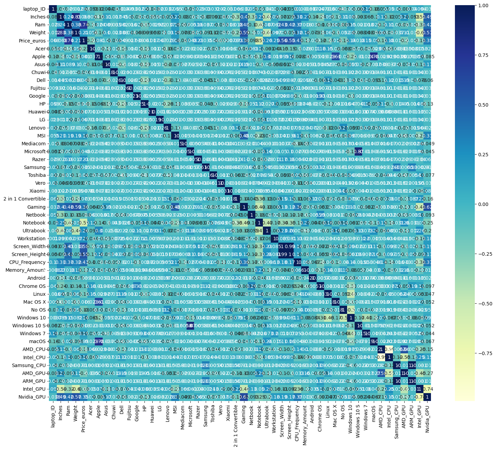
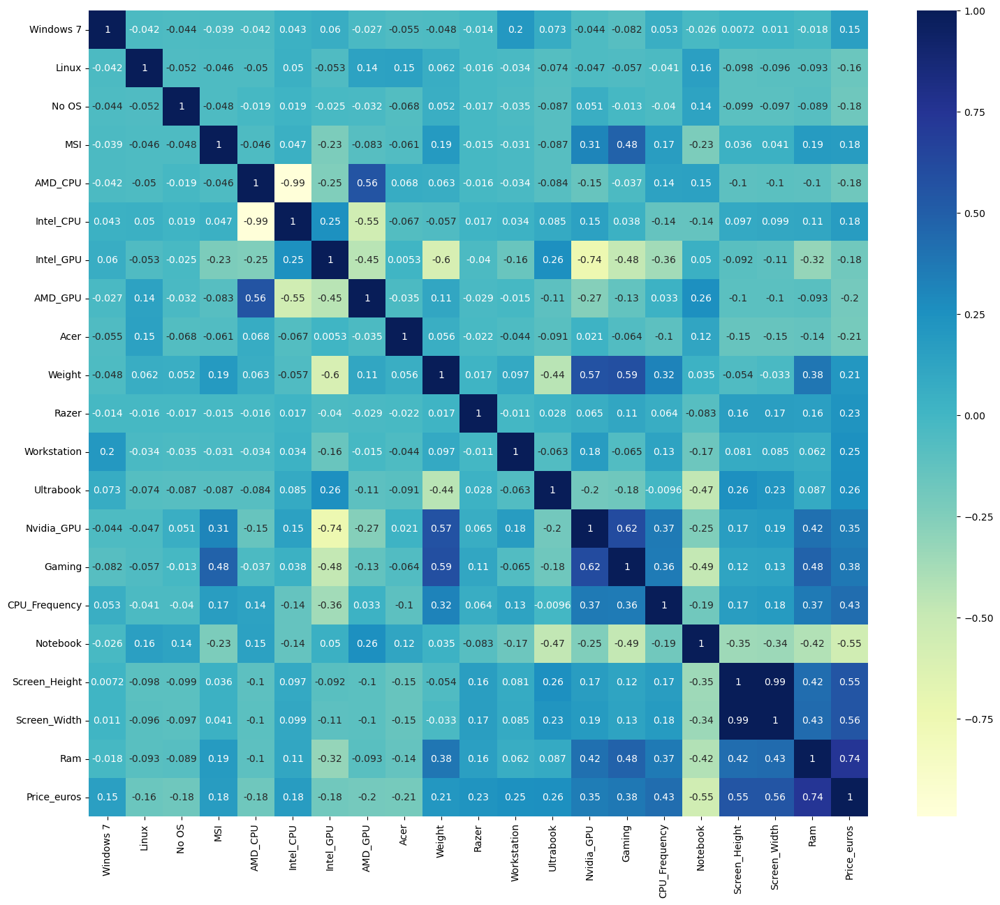
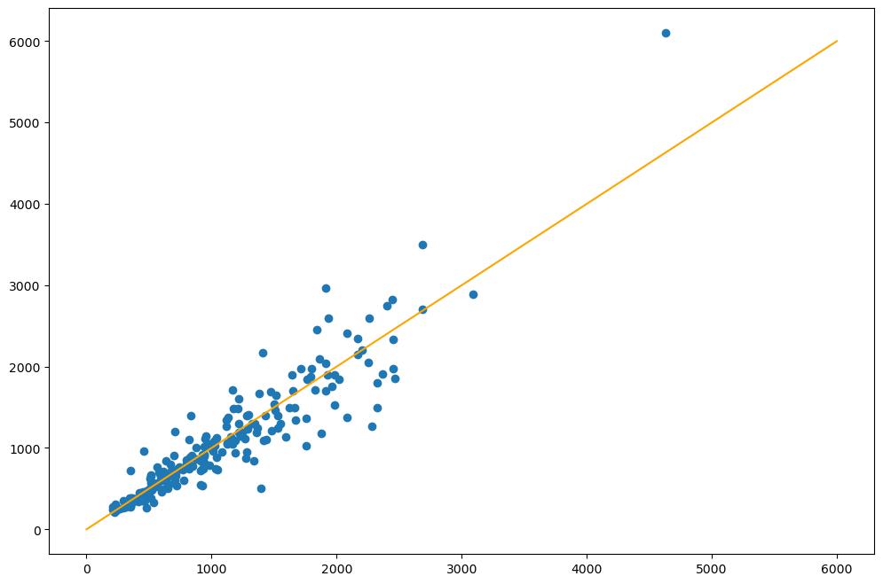

```python
import pandas as pd
```


```python
df = pd.read_csv('laptop_price.csv', encoding='Latin-1')
```


```python
df
```


<div>
<style scoped>
    .dataframe tbody tr th:only-of-type {
        vertical-align: middle;
    }

    .dataframe tbody tr th {
        vertical-align: top;
    }

    .dataframe thead th {
        text-align: right;
    }
</style>
<table border="1" class="dataframe">
  <thead>
    <tr style="text-align: right;">
      <th></th>
      <th>laptop_ID</th>
      <th>Company</th>
      <th>Product</th>
      <th>TypeName</th>
      <th>Inches</th>
      <th>ScreenResolution</th>
      <th>Cpu</th>
      <th>Ram</th>
      <th>Memory</th>
      <th>Gpu</th>
      <th>OpSys</th>
      <th>Weight</th>
      <th>Price_euros</th>
    </tr>
  </thead>
  <tbody>
    <tr>
      <th>0</th>
      <td>1</td>
      <td>Apple</td>
      <td>MacBook Pro</td>
      <td>Ultrabook</td>
      <td>13.3</td>
      <td>IPS Panel Retina Display 2560x1600</td>
      <td>Intel Core i5 2.3GHz</td>
      <td>8GB</td>
      <td>128GB SSD</td>
      <td>Intel Iris Plus Graphics 640</td>
      <td>macOS</td>
      <td>1.37kg</td>
      <td>1339.69</td>
    </tr>
    <tr>
      <th>1</th>
      <td>2</td>
      <td>Apple</td>
      <td>Macbook Air</td>
      <td>Ultrabook</td>
      <td>13.3</td>
      <td>1440x900</td>
      <td>Intel Core i5 1.8GHz</td>
      <td>8GB</td>
      <td>128GB Flash Storage</td>
      <td>Intel HD Graphics 6000</td>
      <td>macOS</td>
      <td>1.34kg</td>
      <td>898.94</td>
    </tr>
    <tr>
      <th>2</th>
      <td>3</td>
      <td>HP</td>
      <td>250 G6</td>
      <td>Notebook</td>
      <td>15.6</td>
      <td>Full HD 1920x1080</td>
      <td>Intel Core i5 7200U 2.5GHz</td>
      <td>8GB</td>
      <td>256GB SSD</td>
      <td>Intel HD Graphics 620</td>
      <td>No OS</td>
      <td>1.86kg</td>
      <td>575.00</td>
    </tr>
    <tr>
      <th>3</th>
      <td>4</td>
      <td>Apple</td>
      <td>MacBook Pro</td>
      <td>Ultrabook</td>
      <td>15.4</td>
      <td>IPS Panel Retina Display 2880x1800</td>
      <td>Intel Core i7 2.7GHz</td>
      <td>16GB</td>
      <td>512GB SSD</td>
      <td>AMD Radeon Pro 455</td>
      <td>macOS</td>
      <td>1.83kg</td>
      <td>2537.45</td>
    </tr>
    <tr>
      <th>4</th>
      <td>5</td>
      <td>Apple</td>
      <td>MacBook Pro</td>
      <td>Ultrabook</td>
      <td>13.3</td>
      <td>IPS Panel Retina Display 2560x1600</td>
      <td>Intel Core i5 3.1GHz</td>
      <td>8GB</td>
      <td>256GB SSD</td>
      <td>Intel Iris Plus Graphics 650</td>
      <td>macOS</td>
      <td>1.37kg</td>
      <td>1803.60</td>
    </tr>
    <tr>
      <th>...</th>
      <td>...</td>
      <td>...</td>
      <td>...</td>
      <td>...</td>
      <td>...</td>
      <td>...</td>
      <td>...</td>
      <td>...</td>
      <td>...</td>
      <td>...</td>
      <td>...</td>
      <td>...</td>
      <td>...</td>
    </tr>
    <tr>
      <th>1298</th>
      <td>1316</td>
      <td>Lenovo</td>
      <td>Yoga 500-14ISK</td>
      <td>2 in 1 Convertible</td>
      <td>14.0</td>
      <td>IPS Panel Full HD / Touchscreen 1920x1080</td>
      <td>Intel Core i7 6500U 2.5GHz</td>
      <td>4GB</td>
      <td>128GB SSD</td>
      <td>Intel HD Graphics 520</td>
      <td>Windows 10</td>
      <td>1.8kg</td>
      <td>638.00</td>
    </tr>
    <tr>
      <th>1299</th>
      <td>1317</td>
      <td>Lenovo</td>
      <td>Yoga 900-13ISK</td>
      <td>2 in 1 Convertible</td>
      <td>13.3</td>
      <td>IPS Panel Quad HD+ / Touchscreen 3200x1800</td>
      <td>Intel Core i7 6500U 2.5GHz</td>
      <td>16GB</td>
      <td>512GB SSD</td>
      <td>Intel HD Graphics 520</td>
      <td>Windows 10</td>
      <td>1.3kg</td>
      <td>1499.00</td>
    </tr>
    <tr>
      <th>1300</th>
      <td>1318</td>
      <td>Lenovo</td>
      <td>IdeaPad 100S-14IBR</td>
      <td>Notebook</td>
      <td>14.0</td>
      <td>1366x768</td>
      <td>Intel Celeron Dual Core N3050 1.6GHz</td>
      <td>2GB</td>
      <td>64GB Flash Storage</td>
      <td>Intel HD Graphics</td>
      <td>Windows 10</td>
      <td>1.5kg</td>
      <td>229.00</td>
    </tr>
    <tr>
      <th>1301</th>
      <td>1319</td>
      <td>HP</td>
      <td>15-AC110nv (i7-6500U/6GB/1TB/Radeon</td>
      <td>Notebook</td>
      <td>15.6</td>
      <td>1366x768</td>
      <td>Intel Core i7 6500U 2.5GHz</td>
      <td>6GB</td>
      <td>1TB HDD</td>
      <td>AMD Radeon R5 M330</td>
      <td>Windows 10</td>
      <td>2.19kg</td>
      <td>764.00</td>
    </tr>
    <tr>
      <th>1302</th>
      <td>1320</td>
      <td>Asus</td>
      <td>X553SA-XX031T (N3050/4GB/500GB/W10)</td>
      <td>Notebook</td>
      <td>15.6</td>
      <td>1366x768</td>
      <td>Intel Celeron Dual Core N3050 1.6GHz</td>
      <td>4GB</td>
      <td>500GB HDD</td>
      <td>Intel HD Graphics</td>
      <td>Windows 10</td>
      <td>2.2kg</td>
      <td>369.00</td>
    </tr>
  </tbody>
</table>
<p>1303 rows × 13 columns</p>
</div>


```python
# Preprocessing
```


```python
df = df.drop('Product', axis=1)
```


```python
df = df.join(pd.get_dummies(df.Company))
df = df.drop('Company', axis=1)
```


```python
df = df.join(pd.get_dummies(df.TypeName))
df = df.drop('TypeName', axis=1)
```


```python
df
```


<div>
<style scoped>
    .dataframe tbody tr th:only-of-type {
        vertical-align: middle;
    }

    .dataframe tbody tr th {
        vertical-align: top;
    }

    .dataframe thead th {
        text-align: right;
    }
</style>
<table border="1" class="dataframe">
  <thead>
    <tr style="text-align: right;">
      <th></th>
      <th>laptop_ID</th>
      <th>Inches</th>
      <th>ScreenResolution</th>
      <th>Cpu</th>
      <th>Ram</th>
      <th>Memory</th>
      <th>Gpu</th>
      <th>OpSys</th>
      <th>Weight</th>
      <th>Price_euros</th>
      <th>...</th>
      <th>Samsung</th>
      <th>Toshiba</th>
      <th>Vero</th>
      <th>Xiaomi</th>
      <th>2 in 1 Convertible</th>
      <th>Gaming</th>
      <th>Netbook</th>
      <th>Notebook</th>
      <th>Ultrabook</th>
      <th>Workstation</th>
    </tr>
  </thead>
  <tbody>
    <tr>
      <th>0</th>
      <td>1</td>
      <td>13.3</td>
      <td>IPS Panel Retina Display 2560x1600</td>
      <td>Intel Core i5 2.3GHz</td>
      <td>8GB</td>
      <td>128GB SSD</td>
      <td>Intel Iris Plus Graphics 640</td>
      <td>macOS</td>
      <td>1.37kg</td>
      <td>1339.69</td>
      <td>...</td>
      <td>0</td>
      <td>0</td>
      <td>0</td>
      <td>0</td>
      <td>0</td>
      <td>0</td>
      <td>0</td>
      <td>0</td>
      <td>1</td>
      <td>0</td>
    </tr>
    <tr>
      <th>1</th>
      <td>2</td>
      <td>13.3</td>
      <td>1440x900</td>
      <td>Intel Core i5 1.8GHz</td>
      <td>8GB</td>
      <td>128GB Flash Storage</td>
      <td>Intel HD Graphics 6000</td>
      <td>macOS</td>
      <td>1.34kg</td>
      <td>898.94</td>
      <td>...</td>
      <td>0</td>
      <td>0</td>
      <td>0</td>
      <td>0</td>
      <td>0</td>
      <td>0</td>
      <td>0</td>
      <td>0</td>
      <td>1</td>
      <td>0</td>
    </tr>
    <tr>
      <th>2</th>
      <td>3</td>
      <td>15.6</td>
      <td>Full HD 1920x1080</td>
      <td>Intel Core i5 7200U 2.5GHz</td>
      <td>8GB</td>
      <td>256GB SSD</td>
      <td>Intel HD Graphics 620</td>
      <td>No OS</td>
      <td>1.86kg</td>
      <td>575.00</td>
      <td>...</td>
      <td>0</td>
      <td>0</td>
      <td>0</td>
      <td>0</td>
      <td>0</td>
      <td>0</td>
      <td>0</td>
      <td>1</td>
      <td>0</td>
      <td>0</td>
    </tr>
    <tr>
      <th>3</th>
      <td>4</td>
      <td>15.4</td>
      <td>IPS Panel Retina Display 2880x1800</td>
      <td>Intel Core i7 2.7GHz</td>
      <td>16GB</td>
      <td>512GB SSD</td>
      <td>AMD Radeon Pro 455</td>
      <td>macOS</td>
      <td>1.83kg</td>
      <td>2537.45</td>
      <td>...</td>
      <td>0</td>
      <td>0</td>
      <td>0</td>
      <td>0</td>
      <td>0</td>
      <td>0</td>
      <td>0</td>
      <td>0</td>
      <td>1</td>
      <td>0</td>
    </tr>
    <tr>
      <th>4</th>
      <td>5</td>
      <td>13.3</td>
      <td>IPS Panel Retina Display 2560x1600</td>
      <td>Intel Core i5 3.1GHz</td>
      <td>8GB</td>
      <td>256GB SSD</td>
      <td>Intel Iris Plus Graphics 650</td>
      <td>macOS</td>
      <td>1.37kg</td>
      <td>1803.60</td>
      <td>...</td>
      <td>0</td>
      <td>0</td>
      <td>0</td>
      <td>0</td>
      <td>0</td>
      <td>0</td>
      <td>0</td>
      <td>0</td>
      <td>1</td>
      <td>0</td>
    </tr>
    <tr>
      <th>...</th>
      <td>...</td>
      <td>...</td>
      <td>...</td>
      <td>...</td>
      <td>...</td>
      <td>...</td>
      <td>...</td>
      <td>...</td>
      <td>...</td>
      <td>...</td>
      <td>...</td>
      <td>...</td>
      <td>...</td>
      <td>...</td>
      <td>...</td>
      <td>...</td>
      <td>...</td>
      <td>...</td>
      <td>...</td>
      <td>...</td>
      <td>...</td>
    </tr>
    <tr>
      <th>1298</th>
      <td>1316</td>
      <td>14.0</td>
      <td>IPS Panel Full HD / Touchscreen 1920x1080</td>
      <td>Intel Core i7 6500U 2.5GHz</td>
      <td>4GB</td>
      <td>128GB SSD</td>
      <td>Intel HD Graphics 520</td>
      <td>Windows 10</td>
      <td>1.8kg</td>
      <td>638.00</td>
      <td>...</td>
      <td>0</td>
      <td>0</td>
      <td>0</td>
      <td>0</td>
      <td>1</td>
      <td>0</td>
      <td>0</td>
      <td>0</td>
      <td>0</td>
      <td>0</td>
    </tr>
    <tr>
      <th>1299</th>
      <td>1317</td>
      <td>13.3</td>
      <td>IPS Panel Quad HD+ / Touchscreen 3200x1800</td>
      <td>Intel Core i7 6500U 2.5GHz</td>
      <td>16GB</td>
      <td>512GB SSD</td>
      <td>Intel HD Graphics 520</td>
      <td>Windows 10</td>
      <td>1.3kg</td>
      <td>1499.00</td>
      <td>...</td>
      <td>0</td>
      <td>0</td>
      <td>0</td>
      <td>0</td>
      <td>1</td>
      <td>0</td>
      <td>0</td>
      <td>0</td>
      <td>0</td>
      <td>0</td>
    </tr>
    <tr>
      <th>1300</th>
      <td>1318</td>
      <td>14.0</td>
      <td>1366x768</td>
      <td>Intel Celeron Dual Core N3050 1.6GHz</td>
      <td>2GB</td>
      <td>64GB Flash Storage</td>
      <td>Intel HD Graphics</td>
      <td>Windows 10</td>
      <td>1.5kg</td>
      <td>229.00</td>
      <td>...</td>
      <td>0</td>
      <td>0</td>
      <td>0</td>
      <td>0</td>
      <td>0</td>
      <td>0</td>
      <td>0</td>
      <td>1</td>
      <td>0</td>
      <td>0</td>
    </tr>
    <tr>
      <th>1301</th>
      <td>1319</td>
      <td>15.6</td>
      <td>1366x768</td>
      <td>Intel Core i7 6500U 2.5GHz</td>
      <td>6GB</td>
      <td>1TB HDD</td>
      <td>AMD Radeon R5 M330</td>
      <td>Windows 10</td>
      <td>2.19kg</td>
      <td>764.00</td>
      <td>...</td>
      <td>0</td>
      <td>0</td>
      <td>0</td>
      <td>0</td>
      <td>0</td>
      <td>0</td>
      <td>0</td>
      <td>1</td>
      <td>0</td>
      <td>0</td>
    </tr>
    <tr>
      <th>1302</th>
      <td>1320</td>
      <td>15.6</td>
      <td>1366x768</td>
      <td>Intel Celeron Dual Core N3050 1.6GHz</td>
      <td>4GB</td>
      <td>500GB HDD</td>
      <td>Intel HD Graphics</td>
      <td>Windows 10</td>
      <td>2.2kg</td>
      <td>369.00</td>
      <td>...</td>
      <td>0</td>
      <td>0</td>
      <td>0</td>
      <td>0</td>
      <td>0</td>
      <td>0</td>
      <td>0</td>
      <td>1</td>
      <td>0</td>
      <td>0</td>
    </tr>
  </tbody>
</table>
<p>1303 rows × 35 columns</p>
</div>


```python
df['ScreenResolution'] = df.ScreenResolution.str.split(' ').apply(lambda x: x[-1])
df['Screen_Width'] = df.ScreenResolution.str.split('x').apply(lambda x: x[0])
df['Screen_Height'] = df.ScreenResolution.str.split('x').apply(lambda x: x[1])
```


```python
df = df.drop('ScreenResolution', axis=1)
```


```python
df
```


<div>
<style scoped>
    .dataframe tbody tr th:only-of-type {
        vertical-align: middle;
    }

    .dataframe tbody tr th {
        vertical-align: top;
    }

    .dataframe thead th {
        text-align: right;
    }
</style>
<table border="1" class="dataframe">
  <thead>
    <tr style="text-align: right;">
      <th></th>
      <th>laptop_ID</th>
      <th>Inches</th>
      <th>Cpu</th>
      <th>Ram</th>
      <th>Memory</th>
      <th>Gpu</th>
      <th>OpSys</th>
      <th>Weight</th>
      <th>Price_euros</th>
      <th>Acer</th>
      <th>...</th>
      <th>Vero</th>
      <th>Xiaomi</th>
      <th>2 in 1 Convertible</th>
      <th>Gaming</th>
      <th>Netbook</th>
      <th>Notebook</th>
      <th>Ultrabook</th>
      <th>Workstation</th>
      <th>Screen_Width</th>
      <th>Screen_Height</th>
    </tr>
  </thead>
  <tbody>
    <tr>
      <th>0</th>
      <td>1</td>
      <td>13.3</td>
      <td>Intel Core i5 2.3GHz</td>
      <td>8GB</td>
      <td>128GB SSD</td>
      <td>Intel Iris Plus Graphics 640</td>
      <td>macOS</td>
      <td>1.37kg</td>
      <td>1339.69</td>
      <td>0</td>
      <td>...</td>
      <td>0</td>
      <td>0</td>
      <td>0</td>
      <td>0</td>
      <td>0</td>
      <td>0</td>
      <td>1</td>
      <td>0</td>
      <td>2560</td>
      <td>1600</td>
    </tr>
    <tr>
      <th>1</th>
      <td>2</td>
      <td>13.3</td>
      <td>Intel Core i5 1.8GHz</td>
      <td>8GB</td>
      <td>128GB Flash Storage</td>
      <td>Intel HD Graphics 6000</td>
      <td>macOS</td>
      <td>1.34kg</td>
      <td>898.94</td>
      <td>0</td>
      <td>...</td>
      <td>0</td>
      <td>0</td>
      <td>0</td>
      <td>0</td>
      <td>0</td>
      <td>0</td>
      <td>1</td>
      <td>0</td>
      <td>1440</td>
      <td>900</td>
    </tr>
    <tr>
      <th>2</th>
      <td>3</td>
      <td>15.6</td>
      <td>Intel Core i5 7200U 2.5GHz</td>
      <td>8GB</td>
      <td>256GB SSD</td>
      <td>Intel HD Graphics 620</td>
      <td>No OS</td>
      <td>1.86kg</td>
      <td>575.00</td>
      <td>0</td>
      <td>...</td>
      <td>0</td>
      <td>0</td>
      <td>0</td>
      <td>0</td>
      <td>0</td>
      <td>1</td>
      <td>0</td>
      <td>0</td>
      <td>1920</td>
      <td>1080</td>
    </tr>
    <tr>
      <th>3</th>
      <td>4</td>
      <td>15.4</td>
      <td>Intel Core i7 2.7GHz</td>
      <td>16GB</td>
      <td>512GB SSD</td>
      <td>AMD Radeon Pro 455</td>
      <td>macOS</td>
      <td>1.83kg</td>
      <td>2537.45</td>
      <td>0</td>
      <td>...</td>
      <td>0</td>
      <td>0</td>
      <td>0</td>
      <td>0</td>
      <td>0</td>
      <td>0</td>
      <td>1</td>
      <td>0</td>
      <td>2880</td>
      <td>1800</td>
    </tr>
    <tr>
      <th>4</th>
      <td>5</td>
      <td>13.3</td>
      <td>Intel Core i5 3.1GHz</td>
      <td>8GB</td>
      <td>256GB SSD</td>
      <td>Intel Iris Plus Graphics 650</td>
      <td>macOS</td>
      <td>1.37kg</td>
      <td>1803.60</td>
      <td>0</td>
      <td>...</td>
      <td>0</td>
      <td>0</td>
      <td>0</td>
      <td>0</td>
      <td>0</td>
      <td>0</td>
      <td>1</td>
      <td>0</td>
      <td>2560</td>
      <td>1600</td>
    </tr>
    <tr>
      <th>...</th>
      <td>...</td>
      <td>...</td>
      <td>...</td>
      <td>...</td>
      <td>...</td>
      <td>...</td>
      <td>...</td>
      <td>...</td>
      <td>...</td>
      <td>...</td>
      <td>...</td>
      <td>...</td>
      <td>...</td>
      <td>...</td>
      <td>...</td>
      <td>...</td>
      <td>...</td>
      <td>...</td>
      <td>...</td>
      <td>...</td>
      <td>...</td>
    </tr>
    <tr>
      <th>1298</th>
      <td>1316</td>
      <td>14.0</td>
      <td>Intel Core i7 6500U 2.5GHz</td>
      <td>4GB</td>
      <td>128GB SSD</td>
      <td>Intel HD Graphics 520</td>
      <td>Windows 10</td>
      <td>1.8kg</td>
      <td>638.00</td>
      <td>0</td>
      <td>...</td>
      <td>0</td>
      <td>0</td>
      <td>1</td>
      <td>0</td>
      <td>0</td>
      <td>0</td>
      <td>0</td>
      <td>0</td>
      <td>1920</td>
      <td>1080</td>
    </tr>
    <tr>
      <th>1299</th>
      <td>1317</td>
      <td>13.3</td>
      <td>Intel Core i7 6500U 2.5GHz</td>
      <td>16GB</td>
      <td>512GB SSD</td>
      <td>Intel HD Graphics 520</td>
      <td>Windows 10</td>
      <td>1.3kg</td>
      <td>1499.00</td>
      <td>0</td>
      <td>...</td>
      <td>0</td>
      <td>0</td>
      <td>1</td>
      <td>0</td>
      <td>0</td>
      <td>0</td>
      <td>0</td>
      <td>0</td>
      <td>3200</td>
      <td>1800</td>
    </tr>
    <tr>
      <th>1300</th>
      <td>1318</td>
      <td>14.0</td>
      <td>Intel Celeron Dual Core N3050 1.6GHz</td>
      <td>2GB</td>
      <td>64GB Flash Storage</td>
      <td>Intel HD Graphics</td>
      <td>Windows 10</td>
      <td>1.5kg</td>
      <td>229.00</td>
      <td>0</td>
      <td>...</td>
      <td>0</td>
      <td>0</td>
      <td>0</td>
      <td>0</td>
      <td>0</td>
      <td>1</td>
      <td>0</td>
      <td>0</td>
      <td>1366</td>
      <td>768</td>
    </tr>
    <tr>
      <th>1301</th>
      <td>1319</td>
      <td>15.6</td>
      <td>Intel Core i7 6500U 2.5GHz</td>
      <td>6GB</td>
      <td>1TB HDD</td>
      <td>AMD Radeon R5 M330</td>
      <td>Windows 10</td>
      <td>2.19kg</td>
      <td>764.00</td>
      <td>0</td>
      <td>...</td>
      <td>0</td>
      <td>0</td>
      <td>0</td>
      <td>0</td>
      <td>0</td>
      <td>1</td>
      <td>0</td>
      <td>0</td>
      <td>1366</td>
      <td>768</td>
    </tr>
    <tr>
      <th>1302</th>
      <td>1320</td>
      <td>15.6</td>
      <td>Intel Celeron Dual Core N3050 1.6GHz</td>
      <td>4GB</td>
      <td>500GB HDD</td>
      <td>Intel HD Graphics</td>
      <td>Windows 10</td>
      <td>2.2kg</td>
      <td>369.00</td>
      <td>0</td>
      <td>...</td>
      <td>0</td>
      <td>0</td>
      <td>0</td>
      <td>0</td>
      <td>0</td>
      <td>1</td>
      <td>0</td>
      <td>0</td>
      <td>1366</td>
      <td>768</td>
    </tr>
  </tbody>
</table>
<p>1303 rows × 36 columns</p>
</div>


```python
df['CPU_Brand'] = df.Cpu.str.split(' ').apply(lambda x: x[0])
df['CPU_Frequency'] = df.Cpu.str.split(' ').apply(lambda x: x[-1])
```


```python
df = df.drop('Cpu', axis=1)
```


```python
df['CPU_Frequency'] = df['CPU_Frequency'].str[:-3]
```


```python
df['Ram'] = df['Ram'].str[:-2]
```


```python
df['Ram'] = df['Ram'].astype('int')
df['CPU_Frequency'] = df['CPU_Frequency'].astype('float')
```


```python
df['Screen_Width'] = df['Screen_Width'].astype('int')
df['Screen_Height'] = df['Screen_Height'].astype('int')
```


```python
df['Memory_Amount'] = df.Memory.str.split(' ').apply(lambda x: x[0])
df['Memory_Type'] = df.Memory.str.split(' ').apply(lambda x: x[1])
```


```python
def memory_into_MB(value):
    if 'GB' in value:
        return float(value[:value.find('GB')]) * 1000
    elif 'TB' in value:
        return float(value[:value.find('TB')]) * 1000000
```


```python
df['Memory_Amount'] = df['Memory_Amount'].apply(memory_into_MB)
```


```python
df = df.drop('Memory', axis=1)
```


```python
df['Weight'] = df['Weight'].str[:-2]
```


```python
df['Weight'] = df['Weight'].astype('float')
```


```python
df
```


<div>
<style scoped>
    .dataframe tbody tr th:only-of-type {
        vertical-align: middle;
    }

    .dataframe tbody tr th {
        vertical-align: top;
    }

    .dataframe thead th {
        text-align: right;
    }
</style>
<table border="1" class="dataframe">
  <thead>
    <tr style="text-align: right;">
      <th></th>
      <th>laptop_ID</th>
      <th>Inches</th>
      <th>Ram</th>
      <th>Gpu</th>
      <th>OpSys</th>
      <th>Weight</th>
      <th>Price_euros</th>
      <th>Acer</th>
      <th>Apple</th>
      <th>Asus</th>
      <th>...</th>
      <th>Netbook</th>
      <th>Notebook</th>
      <th>Ultrabook</th>
      <th>Workstation</th>
      <th>Screen_Width</th>
      <th>Screen_Height</th>
      <th>CPU_Brand</th>
      <th>CPU_Frequency</th>
      <th>Memory_Amount</th>
      <th>Memory_Type</th>
    </tr>
  </thead>
  <tbody>
    <tr>
      <th>0</th>
      <td>1</td>
      <td>13.3</td>
      <td>8</td>
      <td>Intel Iris Plus Graphics 640</td>
      <td>macOS</td>
      <td>1.37</td>
      <td>1339.69</td>
      <td>0</td>
      <td>1</td>
      <td>0</td>
      <td>...</td>
      <td>0</td>
      <td>0</td>
      <td>1</td>
      <td>0</td>
      <td>2560</td>
      <td>1600</td>
      <td>Intel</td>
      <td>2.3</td>
      <td>128000.0</td>
      <td>SSD</td>
    </tr>
    <tr>
      <th>1</th>
      <td>2</td>
      <td>13.3</td>
      <td>8</td>
      <td>Intel HD Graphics 6000</td>
      <td>macOS</td>
      <td>1.34</td>
      <td>898.94</td>
      <td>0</td>
      <td>1</td>
      <td>0</td>
      <td>...</td>
      <td>0</td>
      <td>0</td>
      <td>1</td>
      <td>0</td>
      <td>1440</td>
      <td>900</td>
      <td>Intel</td>
      <td>1.8</td>
      <td>128000.0</td>
      <td>Flash</td>
    </tr>
    <tr>
      <th>2</th>
      <td>3</td>
      <td>15.6</td>
      <td>8</td>
      <td>Intel HD Graphics 620</td>
      <td>No OS</td>
      <td>1.86</td>
      <td>575.00</td>
      <td>0</td>
      <td>0</td>
      <td>0</td>
      <td>...</td>
      <td>0</td>
      <td>1</td>
      <td>0</td>
      <td>0</td>
      <td>1920</td>
      <td>1080</td>
      <td>Intel</td>
      <td>2.5</td>
      <td>256000.0</td>
      <td>SSD</td>
    </tr>
    <tr>
      <th>3</th>
      <td>4</td>
      <td>15.4</td>
      <td>16</td>
      <td>AMD Radeon Pro 455</td>
      <td>macOS</td>
      <td>1.83</td>
      <td>2537.45</td>
      <td>0</td>
      <td>1</td>
      <td>0</td>
      <td>...</td>
      <td>0</td>
      <td>0</td>
      <td>1</td>
      <td>0</td>
      <td>2880</td>
      <td>1800</td>
      <td>Intel</td>
      <td>2.7</td>
      <td>512000.0</td>
      <td>SSD</td>
    </tr>
    <tr>
      <th>4</th>
      <td>5</td>
      <td>13.3</td>
      <td>8</td>
      <td>Intel Iris Plus Graphics 650</td>
      <td>macOS</td>
      <td>1.37</td>
      <td>1803.60</td>
      <td>0</td>
      <td>1</td>
      <td>0</td>
      <td>...</td>
      <td>0</td>
      <td>0</td>
      <td>1</td>
      <td>0</td>
      <td>2560</td>
      <td>1600</td>
      <td>Intel</td>
      <td>3.1</td>
      <td>256000.0</td>
      <td>SSD</td>
    </tr>
    <tr>
      <th>...</th>
      <td>...</td>
      <td>...</td>
      <td>...</td>
      <td>...</td>
      <td>...</td>
      <td>...</td>
      <td>...</td>
      <td>...</td>
      <td>...</td>
      <td>...</td>
      <td>...</td>
      <td>...</td>
      <td>...</td>
      <td>...</td>
      <td>...</td>
      <td>...</td>
      <td>...</td>
      <td>...</td>
      <td>...</td>
      <td>...</td>
      <td>...</td>
    </tr>
    <tr>
      <th>1298</th>
      <td>1316</td>
      <td>14.0</td>
      <td>4</td>
      <td>Intel HD Graphics 520</td>
      <td>Windows 10</td>
      <td>1.80</td>
      <td>638.00</td>
      <td>0</td>
      <td>0</td>
      <td>0</td>
      <td>...</td>
      <td>0</td>
      <td>0</td>
      <td>0</td>
      <td>0</td>
      <td>1920</td>
      <td>1080</td>
      <td>Intel</td>
      <td>2.5</td>
      <td>128000.0</td>
      <td>SSD</td>
    </tr>
    <tr>
      <th>1299</th>
      <td>1317</td>
      <td>13.3</td>
      <td>16</td>
      <td>Intel HD Graphics 520</td>
      <td>Windows 10</td>
      <td>1.30</td>
      <td>1499.00</td>
      <td>0</td>
      <td>0</td>
      <td>0</td>
      <td>...</td>
      <td>0</td>
      <td>0</td>
      <td>0</td>
      <td>0</td>
      <td>3200</td>
      <td>1800</td>
      <td>Intel</td>
      <td>2.5</td>
      <td>512000.0</td>
      <td>SSD</td>
    </tr>
    <tr>
      <th>1300</th>
      <td>1318</td>
      <td>14.0</td>
      <td>2</td>
      <td>Intel HD Graphics</td>
      <td>Windows 10</td>
      <td>1.50</td>
      <td>229.00</td>
      <td>0</td>
      <td>0</td>
      <td>0</td>
      <td>...</td>
      <td>0</td>
      <td>1</td>
      <td>0</td>
      <td>0</td>
      <td>1366</td>
      <td>768</td>
      <td>Intel</td>
      <td>1.6</td>
      <td>64000.0</td>
      <td>Flash</td>
    </tr>
    <tr>
      <th>1301</th>
      <td>1319</td>
      <td>15.6</td>
      <td>6</td>
      <td>AMD Radeon R5 M330</td>
      <td>Windows 10</td>
      <td>2.19</td>
      <td>764.00</td>
      <td>0</td>
      <td>0</td>
      <td>0</td>
      <td>...</td>
      <td>0</td>
      <td>1</td>
      <td>0</td>
      <td>0</td>
      <td>1366</td>
      <td>768</td>
      <td>Intel</td>
      <td>2.5</td>
      <td>1000000.0</td>
      <td>HDD</td>
    </tr>
    <tr>
      <th>1302</th>
      <td>1320</td>
      <td>15.6</td>
      <td>4</td>
      <td>Intel HD Graphics</td>
      <td>Windows 10</td>
      <td>2.20</td>
      <td>369.00</td>
      <td>0</td>
      <td>0</td>
      <td>1</td>
      <td>...</td>
      <td>0</td>
      <td>1</td>
      <td>0</td>
      <td>0</td>
      <td>1366</td>
      <td>768</td>
      <td>Intel</td>
      <td>1.6</td>
      <td>500000.0</td>
      <td>HDD</td>
    </tr>
  </tbody>
</table>
<p>1303 rows × 38 columns</p>
</div>


```python
df['GPU_Brand'] = df.Gpu.str.split(' ').apply(lambda x: x[0])
```


```python
df = df.drop('Gpu', axis=1)
```


```python
df = df.join(pd.get_dummies(df.OpSys))
df = df.drop('OpSys', axis=1)
```


```python
cpu_categories = pd.get_dummies(df['CPU_Brand'])
cpu_categories.columns = [col + '_CPU' for col in cpu_categories.columns]

df = df.join(cpu_categories)
df = df.drop('CPU_Brand', axis=1)
```


```python
gpu_categories = pd.get_dummies(df['GPU_Brand'])
gpu_categories.columns = [col + '_GPU' for col in gpu_categories.columns]

df = df.join(gpu_categories)
df = df.drop('GPU_Brand', axis=1)
```


```python
df
```


<div>
<style scoped>
    .dataframe tbody tr th:only-of-type {
        vertical-align: middle;
    }

    .dataframe tbody tr th {
        vertical-align: top;
    }

    .dataframe thead th {
        text-align: right;
    }
</style>
<table border="1" class="dataframe">
  <thead>
    <tr style="text-align: right;">
      <th></th>
      <th>laptop_ID</th>
      <th>Inches</th>
      <th>Ram</th>
      <th>Weight</th>
      <th>Price_euros</th>
      <th>Acer</th>
      <th>Apple</th>
      <th>Asus</th>
      <th>Chuwi</th>
      <th>Dell</th>
      <th>...</th>
      <th>Windows 10 S</th>
      <th>Windows 7</th>
      <th>macOS</th>
      <th>AMD_CPU</th>
      <th>Intel_CPU</th>
      <th>Samsung_CPU</th>
      <th>AMD_GPU</th>
      <th>ARM_GPU</th>
      <th>Intel_GPU</th>
      <th>Nvidia_GPU</th>
    </tr>
  </thead>
  <tbody>
    <tr>
      <th>0</th>
      <td>1</td>
      <td>13.3</td>
      <td>8</td>
      <td>1.37</td>
      <td>1339.69</td>
      <td>0</td>
      <td>1</td>
      <td>0</td>
      <td>0</td>
      <td>0</td>
      <td>...</td>
      <td>0</td>
      <td>0</td>
      <td>1</td>
      <td>0</td>
      <td>1</td>
      <td>0</td>
      <td>0</td>
      <td>0</td>
      <td>1</td>
      <td>0</td>
    </tr>
    <tr>
      <th>1</th>
      <td>2</td>
      <td>13.3</td>
      <td>8</td>
      <td>1.34</td>
      <td>898.94</td>
      <td>0</td>
      <td>1</td>
      <td>0</td>
      <td>0</td>
      <td>0</td>
      <td>...</td>
      <td>0</td>
      <td>0</td>
      <td>1</td>
      <td>0</td>
      <td>1</td>
      <td>0</td>
      <td>0</td>
      <td>0</td>
      <td>1</td>
      <td>0</td>
    </tr>
    <tr>
      <th>2</th>
      <td>3</td>
      <td>15.6</td>
      <td>8</td>
      <td>1.86</td>
      <td>575.00</td>
      <td>0</td>
      <td>0</td>
      <td>0</td>
      <td>0</td>
      <td>0</td>
      <td>...</td>
      <td>0</td>
      <td>0</td>
      <td>0</td>
      <td>0</td>
      <td>1</td>
      <td>0</td>
      <td>0</td>
      <td>0</td>
      <td>1</td>
      <td>0</td>
    </tr>
    <tr>
      <th>3</th>
      <td>4</td>
      <td>15.4</td>
      <td>16</td>
      <td>1.83</td>
      <td>2537.45</td>
      <td>0</td>
      <td>1</td>
      <td>0</td>
      <td>0</td>
      <td>0</td>
      <td>...</td>
      <td>0</td>
      <td>0</td>
      <td>1</td>
      <td>0</td>
      <td>1</td>
      <td>0</td>
      <td>1</td>
      <td>0</td>
      <td>0</td>
      <td>0</td>
    </tr>
    <tr>
      <th>4</th>
      <td>5</td>
      <td>13.3</td>
      <td>8</td>
      <td>1.37</td>
      <td>1803.60</td>
      <td>0</td>
      <td>1</td>
      <td>0</td>
      <td>0</td>
      <td>0</td>
      <td>...</td>
      <td>0</td>
      <td>0</td>
      <td>1</td>
      <td>0</td>
      <td>1</td>
      <td>0</td>
      <td>0</td>
      <td>0</td>
      <td>1</td>
      <td>0</td>
    </tr>
    <tr>
      <th>...</th>
      <td>...</td>
      <td>...</td>
      <td>...</td>
      <td>...</td>
      <td>...</td>
      <td>...</td>
      <td>...</td>
      <td>...</td>
      <td>...</td>
      <td>...</td>
      <td>...</td>
      <td>...</td>
      <td>...</td>
      <td>...</td>
      <td>...</td>
      <td>...</td>
      <td>...</td>
      <td>...</td>
      <td>...</td>
      <td>...</td>
      <td>...</td>
    </tr>
    <tr>
      <th>1298</th>
      <td>1316</td>
      <td>14.0</td>
      <td>4</td>
      <td>1.80</td>
      <td>638.00</td>
      <td>0</td>
      <td>0</td>
      <td>0</td>
      <td>0</td>
      <td>0</td>
      <td>...</td>
      <td>0</td>
      <td>0</td>
      <td>0</td>
      <td>0</td>
      <td>1</td>
      <td>0</td>
      <td>0</td>
      <td>0</td>
      <td>1</td>
      <td>0</td>
    </tr>
    <tr>
      <th>1299</th>
      <td>1317</td>
      <td>13.3</td>
      <td>16</td>
      <td>1.30</td>
      <td>1499.00</td>
      <td>0</td>
      <td>0</td>
      <td>0</td>
      <td>0</td>
      <td>0</td>
      <td>...</td>
      <td>0</td>
      <td>0</td>
      <td>0</td>
      <td>0</td>
      <td>1</td>
      <td>0</td>
      <td>0</td>
      <td>0</td>
      <td>1</td>
      <td>0</td>
    </tr>
    <tr>
      <th>1300</th>
      <td>1318</td>
      <td>14.0</td>
      <td>2</td>
      <td>1.50</td>
      <td>229.00</td>
      <td>0</td>
      <td>0</td>
      <td>0</td>
      <td>0</td>
      <td>0</td>
      <td>...</td>
      <td>0</td>
      <td>0</td>
      <td>0</td>
      <td>0</td>
      <td>1</td>
      <td>0</td>
      <td>0</td>
      <td>0</td>
      <td>1</td>
      <td>0</td>
    </tr>
    <tr>
      <th>1301</th>
      <td>1319</td>
      <td>15.6</td>
      <td>6</td>
      <td>2.19</td>
      <td>764.00</td>
      <td>0</td>
      <td>0</td>
      <td>0</td>
      <td>0</td>
      <td>0</td>
      <td>...</td>
      <td>0</td>
      <td>0</td>
      <td>0</td>
      <td>0</td>
      <td>1</td>
      <td>0</td>
      <td>1</td>
      <td>0</td>
      <td>0</td>
      <td>0</td>
    </tr>
    <tr>
      <th>1302</th>
      <td>1320</td>
      <td>15.6</td>
      <td>4</td>
      <td>2.20</td>
      <td>369.00</td>
      <td>0</td>
      <td>0</td>
      <td>1</td>
      <td>0</td>
      <td>0</td>
      <td>...</td>
      <td>0</td>
      <td>0</td>
      <td>0</td>
      <td>0</td>
      <td>1</td>
      <td>0</td>
      <td>0</td>
      <td>0</td>
      <td>1</td>
      <td>0</td>
    </tr>
  </tbody>
</table>
<p>1303 rows × 51 columns</p>
</div>


```python
# Correlation and Data Visualization

df.corr()
```


<div>
<style scoped>
    .dataframe tbody tr th:only-of-type {
        vertical-align: middle;
    }

    .dataframe tbody tr th {
        vertical-align: top;
    }

    .dataframe thead th {
        text-align: right;
    }
</style>
<table border="1" class="dataframe">
  <thead>
    <tr style="text-align: right;">
      <th></th>
      <th>laptop_ID</th>
      <th>Inches</th>
      <th>Ram</th>
      <th>Weight</th>
      <th>Price_euros</th>
      <th>Acer</th>
      <th>Apple</th>
      <th>Asus</th>
      <th>Chuwi</th>
      <th>Dell</th>
      <th>...</th>
      <th>Windows 10 S</th>
      <th>Windows 7</th>
      <th>macOS</th>
      <th>AMD_CPU</th>
      <th>Intel_CPU</th>
      <th>Samsung_CPU</th>
      <th>AMD_GPU</th>
      <th>ARM_GPU</th>
      <th>Intel_GPU</th>
      <th>Nvidia_GPU</th>
    </tr>
  </thead>
  <tbody>
    <tr>
      <th>laptop_ID</th>
      <td>1.000000</td>
      <td>-0.087796</td>
      <td>-0.028607</td>
      <td>-0.011798</td>
      <td>0.067830</td>
      <td>-0.057721</td>
      <td>-0.119585</td>
      <td>-0.044252</td>
      <td>-0.043348</td>
      <td>-0.013628</td>
      <td>...</td>
      <td>-0.061942</td>
      <td>0.194094</td>
      <td>-0.158931</td>
      <td>-0.055338</td>
      <td>0.049765</td>
      <td>0.039920</td>
      <td>-0.089050</td>
      <td>0.039920</td>
      <td>0.094479</td>
      <td>-0.037596</td>
    </tr>
    <tr>
      <th>Inches</th>
      <td>-0.087796</td>
      <td>1.000000</td>
      <td>0.237993</td>
      <td>0.827631</td>
      <td>0.068197</td>
      <td>0.009435</td>
      <td>-0.158850</td>
      <td>0.112766</td>
      <td>-0.017426</td>
      <td>0.045288</td>
      <td>...</td>
      <td>-0.093285</td>
      <td>-0.064775</td>
      <td>-0.100867</td>
      <td>0.129801</td>
      <td>-0.122000</td>
      <td>-0.052816</td>
      <td>0.207023</td>
      <td>-0.052816</td>
      <td>-0.592264</td>
      <td>0.486561</td>
    </tr>
    <tr>
      <th>Ram</th>
      <td>-0.028607</td>
      <td>0.237993</td>
      <td>1.000000</td>
      <td>0.383874</td>
      <td>0.743007</td>
      <td>-0.138432</td>
      <td>0.023950</td>
      <td>0.088634</td>
      <td>-0.035117</td>
      <td>0.082241</td>
      <td>...</td>
      <td>-0.021374</td>
      <td>-0.017529</td>
      <td>0.028914</td>
      <td>-0.104759</td>
      <td>0.107051</td>
      <td>-0.023894</td>
      <td>-0.093119</td>
      <td>-0.023894</td>
      <td>-0.319551</td>
      <td>0.415464</td>
    </tr>
    <tr>
      <th>Weight</th>
      <td>-0.011798</td>
      <td>0.827631</td>
      <td>0.383874</td>
      <td>1.000000</td>
      <td>0.210370</td>
      <td>0.056444</td>
      <td>-0.138191</td>
      <td>0.101332</td>
      <td>-0.022536</td>
      <td>0.088465</td>
      <td>...</td>
      <td>-0.087904</td>
      <td>-0.048100</td>
      <td>-0.096042</td>
      <td>0.062641</td>
      <td>-0.057386</td>
      <td>-0.037026</td>
      <td>0.106519</td>
      <td>-0.037026</td>
      <td>-0.596378</td>
      <td>0.565232</td>
    </tr>
    <tr>
      <th>Price_euros</th>
      <td>0.067830</td>
      <td>0.068197</td>
      <td>0.743007</td>
      <td>0.210370</td>
      <td>1.000000</td>
      <td>-0.208349</td>
      <td>0.080688</td>
      <td>-0.010376</td>
      <td>-0.055646</td>
      <td>0.048509</td>
      <td>...</td>
      <td>0.018312</td>
      <td>0.152381</td>
      <td>0.089928</td>
      <td>-0.180111</td>
      <td>0.181127</td>
      <td>-0.018431</td>
      <td>-0.199415</td>
      <td>-0.018431</td>
      <td>-0.184205</td>
      <td>0.348797</td>
    </tr>
    <tr>
      <th>Acer</th>
      <td>-0.057721</td>
      <td>0.009435</td>
      <td>-0.138432</td>
      <td>0.056444</td>
      <td>-0.208349</td>
      <td>1.000000</td>
      <td>-0.037497</td>
      <td>-0.108831</td>
      <td>-0.014074</td>
      <td>-0.159187</td>
      <td>...</td>
      <td>-0.023027</td>
      <td>-0.055411</td>
      <td>-0.029411</td>
      <td>0.068130</td>
      <td>-0.066566</td>
      <td>-0.008119</td>
      <td>-0.034859</td>
      <td>-0.008119</td>
      <td>0.005305</td>
      <td>0.020848</td>
    </tr>
    <tr>
      <th>Apple</th>
      <td>-0.119585</td>
      <td>-0.158850</td>
      <td>0.023950</td>
      <td>-0.138191</td>
      <td>0.080688</td>
      <td>-0.037497</td>
      <td>1.000000</td>
      <td>-0.047544</td>
      <td>-0.006148</td>
      <td>-0.069542</td>
      <td>...</td>
      <td>-0.010059</td>
      <td>-0.024206</td>
      <td>0.784352</td>
      <td>-0.028607</td>
      <td>0.028849</td>
      <td>-0.003547</td>
      <td>0.001749</td>
      <td>-0.003547</td>
      <td>0.078028</td>
      <td>-0.085183</td>
    </tr>
    <tr>
      <th>Asus</th>
      <td>-0.044252</td>
      <td>0.112766</td>
      <td>0.088634</td>
      <td>0.101332</td>
      <td>-0.010376</td>
      <td>-0.108831</td>
      <td>-0.047544</td>
      <td>1.000000</td>
      <td>-0.017845</td>
      <td>-0.201839</td>
      <td>...</td>
      <td>0.030999</td>
      <td>-0.070257</td>
      <td>-0.037291</td>
      <td>0.038455</td>
      <td>-0.036835</td>
      <td>-0.010295</td>
      <td>-0.073770</td>
      <td>-0.010295</td>
      <td>-0.106654</td>
      <td>0.170742</td>
    </tr>
    <tr>
      <th>Chuwi</th>
      <td>-0.043348</td>
      <td>-0.017426</td>
      <td>-0.035117</td>
      <td>-0.022536</td>
      <td>-0.055646</td>
      <td>-0.014074</td>
      <td>-0.006148</td>
      <td>-0.017845</td>
      <td>1.000000</td>
      <td>-0.026102</td>
      <td>...</td>
      <td>-0.003776</td>
      <td>-0.009086</td>
      <td>-0.004822</td>
      <td>-0.010737</td>
      <td>0.010828</td>
      <td>-0.001331</td>
      <td>-0.019232</td>
      <td>-0.001331</td>
      <td>0.043093</td>
      <td>-0.031972</td>
    </tr>
    <tr>
      <th>Dell</th>
      <td>-0.013628</td>
      <td>0.045288</td>
      <td>0.082241</td>
      <td>0.088465</td>
      <td>0.048509</td>
      <td>-0.159187</td>
      <td>-0.069542</td>
      <td>-0.201839</td>
      <td>-0.026102</td>
      <td>1.000000</td>
      <td>...</td>
      <td>-0.042706</td>
      <td>-0.032633</td>
      <td>-0.054545</td>
      <td>-0.121448</td>
      <td>0.122473</td>
      <td>-0.015058</td>
      <td>0.190722</td>
      <td>-0.015058</td>
      <td>-0.075707</td>
      <td>-0.060187</td>
    </tr>
    <tr>
      <th>Fujitsu</th>
      <td>0.009268</td>
      <td>0.019637</td>
      <td>-0.016214</td>
      <td>0.014053</td>
      <td>-0.027135</td>
      <td>-0.014074</td>
      <td>-0.006148</td>
      <td>-0.017845</td>
      <td>-0.002308</td>
      <td>-0.026102</td>
      <td>...</td>
      <td>-0.003776</td>
      <td>-0.009086</td>
      <td>-0.004822</td>
      <td>-0.010737</td>
      <td>0.010828</td>
      <td>-0.001331</td>
      <td>-0.019232</td>
      <td>-0.001331</td>
      <td>0.043093</td>
      <td>-0.031972</td>
    </tr>
    <tr>
      <th>Google</th>
      <td>-0.012039</td>
      <td>-0.091551</td>
      <td>0.021591</td>
      <td>-0.067790</td>
      <td>0.038086</td>
      <td>-0.014074</td>
      <td>-0.006148</td>
      <td>-0.017845</td>
      <td>-0.002308</td>
      <td>-0.026102</td>
      <td>...</td>
      <td>-0.003776</td>
      <td>-0.009086</td>
      <td>-0.004822</td>
      <td>-0.010737</td>
      <td>0.010828</td>
      <td>-0.001331</td>
      <td>-0.019232</td>
      <td>-0.001331</td>
      <td>0.043093</td>
      <td>-0.031972</td>
    </tr>
    <tr>
      <th>HP</th>
      <td>0.059002</td>
      <td>-0.026828</td>
      <td>-0.149220</td>
      <td>-0.098842</td>
      <td>-0.041291</td>
      <td>-0.151180</td>
      <td>-0.066044</td>
      <td>-0.191687</td>
      <td>-0.024789</td>
      <td>-0.280380</td>
      <td>...</td>
      <td>-0.040558</td>
      <td>0.139619</td>
      <td>-0.051802</td>
      <td>0.105827</td>
      <td>-0.103180</td>
      <td>-0.014301</td>
      <td>0.049935</td>
      <td>-0.014301</td>
      <td>0.087806</td>
      <td>-0.131122</td>
    </tr>
    <tr>
      <th>Huawei</th>
      <td>-0.047711</td>
      <td>-0.055473</td>
      <td>-0.002948</td>
      <td>-0.058276</td>
      <td>0.016851</td>
      <td>-0.011487</td>
      <td>-0.005018</td>
      <td>-0.014565</td>
      <td>-0.001883</td>
      <td>-0.021304</td>
      <td>...</td>
      <td>-0.003082</td>
      <td>-0.007416</td>
      <td>-0.003936</td>
      <td>-0.008764</td>
      <td>0.008838</td>
      <td>-0.001087</td>
      <td>-0.015697</td>
      <td>-0.001087</td>
      <td>0.035172</td>
      <td>-0.026095</td>
    </tr>
    <tr>
      <th>LG</th>
      <td>0.022884</td>
      <td>0.001667</td>
      <td>0.021591</td>
      <td>-0.071401</td>
      <td>0.067053</td>
      <td>-0.014074</td>
      <td>-0.006148</td>
      <td>-0.017845</td>
      <td>-0.002308</td>
      <td>-0.026102</td>
      <td>...</td>
      <td>-0.003776</td>
      <td>-0.009086</td>
      <td>-0.004822</td>
      <td>-0.010737</td>
      <td>0.010828</td>
      <td>-0.001331</td>
      <td>-0.019232</td>
      <td>-0.001331</td>
      <td>0.043093</td>
      <td>-0.031972</td>
    </tr>
    <tr>
      <th>Lenovo</th>
      <td>0.031822</td>
      <td>-0.055055</td>
      <td>-0.036538</td>
      <td>-0.029767</td>
      <td>-0.029007</td>
      <td>-0.159187</td>
      <td>-0.069542</td>
      <td>-0.201839</td>
      <td>-0.026102</td>
      <td>-0.295229</td>
      <td>...</td>
      <td>-0.042706</td>
      <td>0.027481</td>
      <td>-0.054545</td>
      <td>0.016053</td>
      <td>-0.013988</td>
      <td>-0.015058</td>
      <td>-0.053171</td>
      <td>-0.015058</td>
      <td>0.064154</td>
      <td>-0.028456</td>
    </tr>
    <tr>
      <th>MSI</th>
      <td>0.054900</td>
      <td>0.207877</td>
      <td>0.190425</td>
      <td>0.194364</td>
      <td>0.180100</td>
      <td>-0.060918</td>
      <td>-0.026612</td>
      <td>-0.077240</td>
      <td>-0.009989</td>
      <td>-0.112978</td>
      <td>...</td>
      <td>-0.016343</td>
      <td>-0.039326</td>
      <td>-0.020873</td>
      <td>-0.046476</td>
      <td>0.046868</td>
      <td>-0.005762</td>
      <td>-0.083246</td>
      <td>-0.005762</td>
      <td>-0.231791</td>
      <td>0.312413</td>
    </tr>
    <tr>
      <th>Mediacom</th>
      <td>-0.015268</td>
      <td>-0.080415</td>
      <td>-0.067495</td>
      <td>-0.077511</td>
      <td>-0.087161</td>
      <td>-0.021532</td>
      <td>-0.009406</td>
      <td>-0.027301</td>
      <td>-0.003530</td>
      <td>-0.039932</td>
      <td>...</td>
      <td>-0.005776</td>
      <td>-0.013900</td>
      <td>-0.007378</td>
      <td>-0.016427</td>
      <td>0.016566</td>
      <td>-0.002037</td>
      <td>-0.029423</td>
      <td>-0.002037</td>
      <td>0.065927</td>
      <td>-0.048914</td>
    </tr>
    <tr>
      <th>Microsoft</th>
      <td>-0.051140</td>
      <td>-0.072377</td>
      <td>-0.005114</td>
      <td>-0.080508</td>
      <td>0.047562</td>
      <td>-0.019927</td>
      <td>-0.008705</td>
      <td>-0.025266</td>
      <td>-0.003267</td>
      <td>-0.036956</td>
      <td>...</td>
      <td>0.865357</td>
      <td>-0.012864</td>
      <td>-0.006828</td>
      <td>-0.015203</td>
      <td>0.015331</td>
      <td>-0.001885</td>
      <td>-0.027230</td>
      <td>-0.001885</td>
      <td>0.061013</td>
      <td>-0.045268</td>
    </tr>
    <tr>
      <th>Razer</th>
      <td>0.029371</td>
      <td>-0.025923</td>
      <td>0.159724</td>
      <td>0.017343</td>
      <td>0.233756</td>
      <td>-0.021532</td>
      <td>-0.009406</td>
      <td>-0.027301</td>
      <td>-0.003530</td>
      <td>-0.039932</td>
      <td>...</td>
      <td>-0.005776</td>
      <td>-0.013900</td>
      <td>-0.007378</td>
      <td>-0.016427</td>
      <td>0.016566</td>
      <td>-0.002037</td>
      <td>-0.029423</td>
      <td>-0.002037</td>
      <td>-0.039683</td>
      <td>0.064898</td>
    </tr>
    <tr>
      <th>Samsung</th>
      <td>0.029782</td>
      <td>-0.069898</td>
      <td>0.037484</td>
      <td>-0.090664</td>
      <td>0.034584</td>
      <td>-0.024433</td>
      <td>-0.010674</td>
      <td>-0.030980</td>
      <td>-0.004006</td>
      <td>-0.045314</td>
      <td>...</td>
      <td>-0.006555</td>
      <td>-0.015773</td>
      <td>-0.008372</td>
      <td>-0.018641</td>
      <td>-0.024401</td>
      <td>0.332308</td>
      <td>-0.006533</td>
      <td>0.332308</td>
      <td>0.000243</td>
      <td>-0.015326</td>
    </tr>
    <tr>
      <th>Toshiba</th>
      <td>0.031935</td>
      <td>-0.090946</td>
      <td>0.010946</td>
      <td>-0.117163</td>
      <td>0.040339</td>
      <td>-0.057296</td>
      <td>-0.025030</td>
      <td>-0.072648</td>
      <td>-0.009395</td>
      <td>-0.106262</td>
      <td>...</td>
      <td>-0.015371</td>
      <td>0.007637</td>
      <td>-0.019632</td>
      <td>-0.043713</td>
      <td>0.044082</td>
      <td>-0.005420</td>
      <td>-0.078297</td>
      <td>-0.005420</td>
      <td>0.126255</td>
      <td>-0.077162</td>
    </tr>
    <tr>
      <th>Vero</th>
      <td>0.019820</td>
      <td>-0.046401</td>
      <td>-0.053302</td>
      <td>-0.059121</td>
      <td>-0.071972</td>
      <td>-0.016257</td>
      <td>-0.007102</td>
      <td>-0.020613</td>
      <td>-0.002666</td>
      <td>-0.030151</td>
      <td>...</td>
      <td>-0.004361</td>
      <td>-0.010495</td>
      <td>-0.005571</td>
      <td>-0.012403</td>
      <td>0.012508</td>
      <td>-0.001538</td>
      <td>-0.022216</td>
      <td>-0.001538</td>
      <td>0.049779</td>
      <td>-0.036933</td>
    </tr>
    <tr>
      <th>Xiaomi</th>
      <td>-0.030861</td>
      <td>-0.022075</td>
      <td>0.017663</td>
      <td>-0.034930</td>
      <td>0.000776</td>
      <td>-0.016257</td>
      <td>-0.007102</td>
      <td>-0.020613</td>
      <td>-0.002666</td>
      <td>-0.030151</td>
      <td>...</td>
      <td>-0.004361</td>
      <td>-0.010495</td>
      <td>-0.005571</td>
      <td>-0.012403</td>
      <td>0.012508</td>
      <td>-0.001538</td>
      <td>-0.022216</td>
      <td>-0.001538</td>
      <td>-0.061859</td>
      <td>0.083376</td>
    </tr>
    <tr>
      <th>2 in 1 Convertible</th>
      <td>0.066227</td>
      <td>-0.314691</td>
      <td>0.017560</td>
      <td>-0.236693</td>
      <td>0.072675</td>
      <td>-0.015336</td>
      <td>-0.040950</td>
      <td>-0.013546</td>
      <td>-0.015370</td>
      <td>0.015253</td>
      <td>...</td>
      <td>-0.025147</td>
      <td>-0.046032</td>
      <td>-0.032119</td>
      <td>-0.071514</td>
      <td>0.059791</td>
      <td>0.086618</td>
      <td>-0.112768</td>
      <td>0.086618</td>
      <td>0.223178</td>
      <td>-0.161351</td>
    </tr>
    <tr>
      <th>Gaming</th>
      <td>0.032384</td>
      <td>0.402666</td>
      <td>0.481728</td>
      <td>0.591756</td>
      <td>0.375789</td>
      <td>-0.064096</td>
      <td>-0.055302</td>
      <td>0.188172</td>
      <td>-0.020757</td>
      <td>-0.033798</td>
      <td>...</td>
      <td>-0.033961</td>
      <td>-0.081723</td>
      <td>-0.043376</td>
      <td>-0.037173</td>
      <td>0.038438</td>
      <td>-0.011975</td>
      <td>-0.130230</td>
      <td>-0.011975</td>
      <td>-0.481677</td>
      <td>0.617228</td>
    </tr>
    <tr>
      <th>Netbook</th>
      <td>0.058880</td>
      <td>-0.314030</td>
      <td>-0.102976</td>
      <td>-0.154059</td>
      <td>-0.097572</td>
      <td>0.062698</td>
      <td>-0.017901</td>
      <td>0.016599</td>
      <td>-0.006719</td>
      <td>-0.049322</td>
      <td>...</td>
      <td>0.060626</td>
      <td>0.004185</td>
      <td>-0.014040</td>
      <td>-0.031262</td>
      <td>0.031526</td>
      <td>-0.003876</td>
      <td>-0.055995</td>
      <td>-0.003876</td>
      <td>0.125465</td>
      <td>-0.093087</td>
    </tr>
    <tr>
      <th>Notebook</th>
      <td>-0.049769</td>
      <td>0.246907</td>
      <td>-0.416486</td>
      <td>0.034893</td>
      <td>-0.549248</td>
      <td>0.117594</td>
      <td>-0.143788</td>
      <td>-0.100149</td>
      <td>0.042760</td>
      <td>-0.002612</td>
      <td>...</td>
      <td>-0.068518</td>
      <td>-0.026298</td>
      <td>-0.112780</td>
      <td>0.148141</td>
      <td>-0.143000</td>
      <td>-0.031135</td>
      <td>0.257833</td>
      <td>-0.031135</td>
      <td>0.050256</td>
      <td>-0.245171</td>
    </tr>
    <tr>
      <th>Ultrabook</th>
      <td>-0.040689</td>
      <td>-0.417950</td>
      <td>0.087470</td>
      <td>-0.439952</td>
      <td>0.255658</td>
      <td>-0.091450</td>
      <td>0.304167</td>
      <td>-0.024773</td>
      <td>-0.020214</td>
      <td>0.022132</td>
      <td>...</td>
      <td>0.131825</td>
      <td>0.073258</td>
      <td>0.238574</td>
      <td>-0.083967</td>
      <td>0.084837</td>
      <td>-0.011661</td>
      <td>-0.106243</td>
      <td>-0.011661</td>
      <td>0.256530</td>
      <td>-0.196273</td>
    </tr>
    <tr>
      <th>Workstation</th>
      <td>0.001167</td>
      <td>0.098893</td>
      <td>0.062353</td>
      <td>0.097031</td>
      <td>0.249752</td>
      <td>-0.044202</td>
      <td>-0.019310</td>
      <td>-0.056045</td>
      <td>-0.007248</td>
      <td>0.054442</td>
      <td>...</td>
      <td>-0.011858</td>
      <td>0.199396</td>
      <td>-0.015146</td>
      <td>-0.033723</td>
      <td>0.034007</td>
      <td>-0.004181</td>
      <td>-0.015170</td>
      <td>-0.004181</td>
      <td>-0.157721</td>
      <td>0.181570</td>
    </tr>
    <tr>
      <th>Screen_Width</th>
      <td>-0.042878</td>
      <td>-0.071245</td>
      <td>0.433121</td>
      <td>-0.032880</td>
      <td>0.556529</td>
      <td>-0.148089</td>
      <td>0.099095</td>
      <td>-0.051020</td>
      <td>0.028876</td>
      <td>0.098527</td>
      <td>...</td>
      <td>0.022050</td>
      <td>0.010784</td>
      <td>0.107070</td>
      <td>-0.102955</td>
      <td>0.098520</td>
      <td>0.028317</td>
      <td>-0.099868</td>
      <td>0.028317</td>
      <td>-0.105671</td>
      <td>0.186887</td>
    </tr>
    <tr>
      <th>Screen_Height</th>
      <td>-0.053912</td>
      <td>-0.095404</td>
      <td>0.424437</td>
      <td>-0.053846</td>
      <td>0.552809</td>
      <td>-0.150171</td>
      <td>0.156872</td>
      <td>-0.056570</td>
      <td>0.043437</td>
      <td>0.086603</td>
      <td>...</td>
      <td>0.068859</td>
      <td>0.007162</td>
      <td>0.156369</td>
      <td>-0.104746</td>
      <td>0.097296</td>
      <td>0.051564</td>
      <td>-0.100644</td>
      <td>0.051564</td>
      <td>-0.091678</td>
      <td>0.170993</td>
    </tr>
    <tr>
      <th>CPU_Frequency</th>
      <td>0.102716</td>
      <td>0.307870</td>
      <td>0.368000</td>
      <td>0.320434</td>
      <td>0.430293</td>
      <td>-0.104940</td>
      <td>-0.077957</td>
      <td>-0.022603</td>
      <td>-0.092263</td>
      <td>-0.020369</td>
      <td>...</td>
      <td>-0.015338</td>
      <td>0.052773</td>
      <td>0.004821</td>
      <td>0.142283</td>
      <td>-0.139094</td>
      <td>-0.016359</td>
      <td>0.033050</td>
      <td>-0.016359</td>
      <td>-0.363658</td>
      <td>0.368158</td>
    </tr>
    <tr>
      <th>Memory_Amount</th>
      <td>-0.000809</td>
      <td>0.269511</td>
      <td>0.018271</td>
      <td>0.179962</td>
      <td>-0.122365</td>
      <td>0.028170</td>
      <td>-0.042976</td>
      <td>-0.015405</td>
      <td>-0.051077</td>
      <td>0.058051</td>
      <td>...</td>
      <td>-0.051785</td>
      <td>-0.039820</td>
      <td>-0.030403</td>
      <td>0.104257</td>
      <td>-0.099342</td>
      <td>-0.031957</td>
      <td>0.158836</td>
      <td>-0.031957</td>
      <td>-0.120888</td>
      <td>0.013372</td>
    </tr>
    <tr>
      <th>Android</th>
      <td>-0.007219</td>
      <td>-0.135222</td>
      <td>-0.033804</td>
      <td>-0.079495</td>
      <td>-0.038700</td>
      <td>-0.011487</td>
      <td>-0.005018</td>
      <td>-0.014565</td>
      <td>-0.001883</td>
      <td>-0.021304</td>
      <td>...</td>
      <td>-0.003082</td>
      <td>-0.007416</td>
      <td>-0.003936</td>
      <td>-0.008764</td>
      <td>0.008838</td>
      <td>-0.001087</td>
      <td>-0.015697</td>
      <td>-0.001087</td>
      <td>0.035172</td>
      <td>-0.026095</td>
    </tr>
    <tr>
      <th>Chrome OS</th>
      <td>0.046729</td>
      <td>-0.236792</td>
      <td>-0.102096</td>
      <td>-0.139835</td>
      <td>-0.118684</td>
      <td>0.177027</td>
      <td>-0.018618</td>
      <td>-0.004522</td>
      <td>-0.006988</td>
      <td>-0.066195</td>
      <td>...</td>
      <td>-0.011433</td>
      <td>-0.027512</td>
      <td>-0.014603</td>
      <td>-0.032514</td>
      <td>0.007672</td>
      <td>0.190519</td>
      <td>-0.058238</td>
      <td>0.190519</td>
      <td>0.119651</td>
      <td>-0.096815</td>
    </tr>
    <tr>
      <th>Linux</th>
      <td>-0.015589</td>
      <td>0.094654</td>
      <td>-0.093410</td>
      <td>0.062424</td>
      <td>-0.162060</td>
      <td>0.148299</td>
      <td>-0.028607</td>
      <td>0.027411</td>
      <td>-0.010737</td>
      <td>0.187929</td>
      <td>...</td>
      <td>-0.017568</td>
      <td>-0.042274</td>
      <td>-0.022438</td>
      <td>-0.049960</td>
      <td>0.050381</td>
      <td>-0.006194</td>
      <td>0.140372</td>
      <td>-0.006194</td>
      <td>-0.053341</td>
      <td>-0.047154</td>
    </tr>
    <tr>
      <th>Mac OS X</th>
      <td>0.009431</td>
      <td>-0.127740</td>
      <td>0.001822</td>
      <td>-0.100576</td>
      <td>0.015656</td>
      <td>-0.023027</td>
      <td>0.614108</td>
      <td>-0.029197</td>
      <td>-0.003776</td>
      <td>-0.042706</td>
      <td>...</td>
      <td>-0.006178</td>
      <td>-0.014865</td>
      <td>-0.007890</td>
      <td>-0.017568</td>
      <td>0.017716</td>
      <td>-0.002178</td>
      <td>-0.031467</td>
      <td>-0.002178</td>
      <td>0.070507</td>
      <td>-0.052311</td>
    </tr>
    <tr>
      <th>No OS</th>
      <td>-0.069617</td>
      <td>0.110131</td>
      <td>-0.088980</td>
      <td>0.051578</td>
      <td>-0.177094</td>
      <td>-0.067673</td>
      <td>-0.029563</td>
      <td>-0.042919</td>
      <td>-0.011096</td>
      <td>-0.125507</td>
      <td>...</td>
      <td>-0.018155</td>
      <td>-0.043687</td>
      <td>-0.023188</td>
      <td>-0.018749</td>
      <td>0.019434</td>
      <td>-0.006401</td>
      <td>-0.031620</td>
      <td>-0.006401</td>
      <td>-0.025143</td>
      <td>0.051134</td>
    </tr>
    <tr>
      <th>Windows 10</th>
      <td>-0.008729</td>
      <td>0.088614</td>
      <td>0.149562</td>
      <td>0.082438</td>
      <td>0.137048</td>
      <td>-0.065093</td>
      <td>-0.275713</td>
      <td>0.055472</td>
      <td>0.022300</td>
      <td>0.041451</td>
      <td>...</td>
      <td>-0.169317</td>
      <td>-0.407434</td>
      <td>-0.216256</td>
      <td>0.075438</td>
      <td>-0.067160</td>
      <td>-0.059702</td>
      <td>-0.023814</td>
      <td>-0.059702</td>
      <td>-0.068734</td>
      <td>0.095472</td>
    </tr>
    <tr>
      <th>Windows 10 S</th>
      <td>-0.061942</td>
      <td>-0.093285</td>
      <td>-0.021374</td>
      <td>-0.087904</td>
      <td>0.018312</td>
      <td>-0.023027</td>
      <td>-0.010059</td>
      <td>0.030999</td>
      <td>-0.003776</td>
      <td>-0.042706</td>
      <td>...</td>
      <td>1.000000</td>
      <td>-0.014865</td>
      <td>-0.007890</td>
      <td>0.028583</td>
      <td>-0.028086</td>
      <td>-0.002178</td>
      <td>-0.002994</td>
      <td>-0.002178</td>
      <td>0.050741</td>
      <td>-0.052311</td>
    </tr>
    <tr>
      <th>Windows 7</th>
      <td>0.194094</td>
      <td>-0.064775</td>
      <td>-0.017529</td>
      <td>-0.048100</td>
      <td>0.152381</td>
      <td>-0.055411</td>
      <td>-0.024206</td>
      <td>-0.070257</td>
      <td>-0.009086</td>
      <td>-0.032633</td>
      <td>...</td>
      <td>-0.014865</td>
      <td>1.000000</td>
      <td>-0.018986</td>
      <td>-0.042274</td>
      <td>0.042631</td>
      <td>-0.005242</td>
      <td>-0.026998</td>
      <td>-0.005242</td>
      <td>0.059740</td>
      <td>-0.043869</td>
    </tr>
    <tr>
      <th>macOS</th>
      <td>-0.158931</td>
      <td>-0.100867</td>
      <td>0.028914</td>
      <td>-0.096042</td>
      <td>0.089928</td>
      <td>-0.029411</td>
      <td>0.784352</td>
      <td>-0.037291</td>
      <td>-0.004822</td>
      <td>-0.054545</td>
      <td>...</td>
      <td>-0.007890</td>
      <td>-0.018986</td>
      <td>1.000000</td>
      <td>-0.022438</td>
      <td>0.022627</td>
      <td>-0.002782</td>
      <td>0.026948</td>
      <td>-0.002782</td>
      <td>0.043447</td>
      <td>-0.066813</td>
    </tr>
    <tr>
      <th>AMD_CPU</th>
      <td>-0.055338</td>
      <td>0.129801</td>
      <td>-0.104759</td>
      <td>0.062641</td>
      <td>-0.180111</td>
      <td>0.068130</td>
      <td>-0.028607</td>
      <td>0.038455</td>
      <td>-0.010737</td>
      <td>-0.121448</td>
      <td>...</td>
      <td>0.028583</td>
      <td>-0.042274</td>
      <td>-0.022438</td>
      <td>1.000000</td>
      <td>-0.991632</td>
      <td>-0.006194</td>
      <td>0.558295</td>
      <td>-0.006194</td>
      <td>-0.249167</td>
      <td>-0.148763</td>
    </tr>
    <tr>
      <th>Intel_CPU</th>
      <td>0.049765</td>
      <td>-0.122000</td>
      <td>0.107051</td>
      <td>-0.057386</td>
      <td>0.181127</td>
      <td>-0.066566</td>
      <td>0.028849</td>
      <td>-0.036835</td>
      <td>0.010828</td>
      <td>0.122473</td>
      <td>...</td>
      <td>-0.028086</td>
      <td>0.042631</td>
      <td>0.022627</td>
      <td>-0.991632</td>
      <td>1.000000</td>
      <td>-0.122952</td>
      <td>-0.552637</td>
      <td>-0.122952</td>
      <td>0.251270</td>
      <td>0.150019</td>
    </tr>
    <tr>
      <th>Samsung_CPU</th>
      <td>0.039920</td>
      <td>-0.052816</td>
      <td>-0.023894</td>
      <td>-0.037026</td>
      <td>-0.018431</td>
      <td>-0.008119</td>
      <td>-0.003547</td>
      <td>-0.010295</td>
      <td>-0.001331</td>
      <td>-0.015058</td>
      <td>...</td>
      <td>-0.002178</td>
      <td>-0.005242</td>
      <td>-0.002782</td>
      <td>-0.006194</td>
      <td>-0.122952</td>
      <td>1.000000</td>
      <td>-0.011095</td>
      <td>1.000000</td>
      <td>-0.030894</td>
      <td>-0.018445</td>
    </tr>
    <tr>
      <th>AMD_GPU</th>
      <td>-0.089050</td>
      <td>0.207023</td>
      <td>-0.093119</td>
      <td>0.106519</td>
      <td>-0.199415</td>
      <td>-0.034859</td>
      <td>0.001749</td>
      <td>-0.073770</td>
      <td>-0.019232</td>
      <td>0.190722</td>
      <td>...</td>
      <td>-0.002994</td>
      <td>-0.026998</td>
      <td>0.026948</td>
      <td>0.558295</td>
      <td>-0.552637</td>
      <td>-0.011095</td>
      <td>1.000000</td>
      <td>-0.011095</td>
      <td>-0.446300</td>
      <td>-0.266460</td>
    </tr>
    <tr>
      <th>ARM_GPU</th>
      <td>0.039920</td>
      <td>-0.052816</td>
      <td>-0.023894</td>
      <td>-0.037026</td>
      <td>-0.018431</td>
      <td>-0.008119</td>
      <td>-0.003547</td>
      <td>-0.010295</td>
      <td>-0.001331</td>
      <td>-0.015058</td>
      <td>...</td>
      <td>-0.002178</td>
      <td>-0.005242</td>
      <td>-0.002782</td>
      <td>-0.006194</td>
      <td>-0.122952</td>
      <td>1.000000</td>
      <td>-0.011095</td>
      <td>1.000000</td>
      <td>-0.030894</td>
      <td>-0.018445</td>
    </tr>
    <tr>
      <th>Intel_GPU</th>
      <td>0.094479</td>
      <td>-0.592264</td>
      <td>-0.319551</td>
      <td>-0.596378</td>
      <td>-0.184205</td>
      <td>0.005305</td>
      <td>0.078028</td>
      <td>-0.106654</td>
      <td>0.043093</td>
      <td>-0.075707</td>
      <td>...</td>
      <td>0.050741</td>
      <td>0.059740</td>
      <td>0.043447</td>
      <td>-0.249167</td>
      <td>0.251270</td>
      <td>-0.030894</td>
      <td>-0.446300</td>
      <td>-0.030894</td>
      <td>1.000000</td>
      <td>-0.741936</td>
    </tr>
    <tr>
      <th>Nvidia_GPU</th>
      <td>-0.037596</td>
      <td>0.486561</td>
      <td>0.415464</td>
      <td>0.565232</td>
      <td>0.348797</td>
      <td>0.020848</td>
      <td>-0.085183</td>
      <td>0.170742</td>
      <td>-0.031972</td>
      <td>-0.060187</td>
      <td>...</td>
      <td>-0.052311</td>
      <td>-0.043869</td>
      <td>-0.066813</td>
      <td>-0.148763</td>
      <td>0.150019</td>
      <td>-0.018445</td>
      <td>-0.266460</td>
      <td>-0.018445</td>
      <td>-0.741936</td>
      <td>1.000000</td>
    </tr>
  </tbody>
</table>
<p>50 rows × 50 columns</p>
</div>


```python
import seaborn as sns
import matplotlib.pyplot as plt

plt.figure(figsize=(18, 15))
sns.heatmap(df.corr(), annot=True, cmap='YlGnBu')
```


    <AxesSubplot:>


    

    


```python
target_correlations = df.corr()['Price_euros'].apply(abs).sort_values()
```


```python
target_correlations
```


    Xiaomi                0.000776
    Asus                  0.010376
    Mac OS X              0.015656
    Huawei                0.016851
    Windows 10 S          0.018312
    ARM_GPU               0.018431
    Samsung_CPU           0.018431
    Fujitsu               0.027135
    Lenovo                0.029007
    Samsung               0.034584
    Google                0.038086
    Android               0.038700
    Toshiba               0.040339
    HP                    0.041291
    Microsoft             0.047562
    Dell                  0.048509
    Chuwi                 0.055646
    LG                    0.067053
    laptop_ID             0.067830
    Inches                0.068197
    Vero                  0.071972
    2 in 1 Convertible    0.072675
    Apple                 0.080688
    Mediacom              0.087161
    macOS                 0.089928
    Netbook               0.097572
    Chrome OS             0.118684
    Memory_Amount         0.122365
    Windows 10            0.137048
    Windows 7             0.152381
    Linux                 0.162060
    No OS                 0.177094
    MSI                   0.180100
    AMD_CPU               0.180111
    Intel_CPU             0.181127
    Intel_GPU             0.184205
    AMD_GPU               0.199415
    Acer                  0.208349
    Weight                0.210370
    Razer                 0.233756
    Workstation           0.249752
    Ultrabook             0.255658
    Nvidia_GPU            0.348797
    Gaming                0.375789
    CPU_Frequency         0.430293
    Notebook              0.549248
    Screen_Height         0.552809
    Screen_Width          0.556529
    Ram                   0.743007
    Price_euros           1.000000
    Name: Price_euros, dtype: float64


```python
selected_features = target_correlations[-21:].index
```


```python
selected_features = list(selected_features)
```


```python
selected_features
```


    ['Windows 7',
     'Linux',
     'No OS',
     'MSI',
     'AMD_CPU',
     'Intel_CPU',
     'Intel_GPU',
     'AMD_GPU',
     'Acer',
     'Weight',
     'Razer',
     'Workstation',
     'Ultrabook',
     'Nvidia_GPU',
     'Gaming',
     'CPU_Frequency',
     'Notebook',
     'Screen_Height',
     'Screen_Width',
     'Ram',
     'Price_euros']


```python
limited_df = df[selected_features]
```


```python
limited_df
```


<div>
<style scoped>
    .dataframe tbody tr th:only-of-type {
        vertical-align: middle;
    }

    .dataframe tbody tr th {
        vertical-align: top;
    }

    .dataframe thead th {
        text-align: right;
    }
</style>
<table border="1" class="dataframe">
  <thead>
    <tr style="text-align: right;">
      <th></th>
      <th>Windows 7</th>
      <th>Linux</th>
      <th>No OS</th>
      <th>MSI</th>
      <th>AMD_CPU</th>
      <th>Intel_CPU</th>
      <th>Intel_GPU</th>
      <th>AMD_GPU</th>
      <th>Acer</th>
      <th>Weight</th>
      <th>...</th>
      <th>Workstation</th>
      <th>Ultrabook</th>
      <th>Nvidia_GPU</th>
      <th>Gaming</th>
      <th>CPU_Frequency</th>
      <th>Notebook</th>
      <th>Screen_Height</th>
      <th>Screen_Width</th>
      <th>Ram</th>
      <th>Price_euros</th>
    </tr>
  </thead>
  <tbody>
    <tr>
      <th>0</th>
      <td>0</td>
      <td>0</td>
      <td>0</td>
      <td>0</td>
      <td>0</td>
      <td>1</td>
      <td>1</td>
      <td>0</td>
      <td>0</td>
      <td>1.37</td>
      <td>...</td>
      <td>0</td>
      <td>1</td>
      <td>0</td>
      <td>0</td>
      <td>2.3</td>
      <td>0</td>
      <td>1600</td>
      <td>2560</td>
      <td>8</td>
      <td>1339.69</td>
    </tr>
    <tr>
      <th>1</th>
      <td>0</td>
      <td>0</td>
      <td>0</td>
      <td>0</td>
      <td>0</td>
      <td>1</td>
      <td>1</td>
      <td>0</td>
      <td>0</td>
      <td>1.34</td>
      <td>...</td>
      <td>0</td>
      <td>1</td>
      <td>0</td>
      <td>0</td>
      <td>1.8</td>
      <td>0</td>
      <td>900</td>
      <td>1440</td>
      <td>8</td>
      <td>898.94</td>
    </tr>
    <tr>
      <th>2</th>
      <td>0</td>
      <td>0</td>
      <td>1</td>
      <td>0</td>
      <td>0</td>
      <td>1</td>
      <td>1</td>
      <td>0</td>
      <td>0</td>
      <td>1.86</td>
      <td>...</td>
      <td>0</td>
      <td>0</td>
      <td>0</td>
      <td>0</td>
      <td>2.5</td>
      <td>1</td>
      <td>1080</td>
      <td>1920</td>
      <td>8</td>
      <td>575.00</td>
    </tr>
    <tr>
      <th>3</th>
      <td>0</td>
      <td>0</td>
      <td>0</td>
      <td>0</td>
      <td>0</td>
      <td>1</td>
      <td>0</td>
      <td>1</td>
      <td>0</td>
      <td>1.83</td>
      <td>...</td>
      <td>0</td>
      <td>1</td>
      <td>0</td>
      <td>0</td>
      <td>2.7</td>
      <td>0</td>
      <td>1800</td>
      <td>2880</td>
      <td>16</td>
      <td>2537.45</td>
    </tr>
    <tr>
      <th>4</th>
      <td>0</td>
      <td>0</td>
      <td>0</td>
      <td>0</td>
      <td>0</td>
      <td>1</td>
      <td>1</td>
      <td>0</td>
      <td>0</td>
      <td>1.37</td>
      <td>...</td>
      <td>0</td>
      <td>1</td>
      <td>0</td>
      <td>0</td>
      <td>3.1</td>
      <td>0</td>
      <td>1600</td>
      <td>2560</td>
      <td>8</td>
      <td>1803.60</td>
    </tr>
    <tr>
      <th>...</th>
      <td>...</td>
      <td>...</td>
      <td>...</td>
      <td>...</td>
      <td>...</td>
      <td>...</td>
      <td>...</td>
      <td>...</td>
      <td>...</td>
      <td>...</td>
      <td>...</td>
      <td>...</td>
      <td>...</td>
      <td>...</td>
      <td>...</td>
      <td>...</td>
      <td>...</td>
      <td>...</td>
      <td>...</td>
      <td>...</td>
      <td>...</td>
    </tr>
    <tr>
      <th>1298</th>
      <td>0</td>
      <td>0</td>
      <td>0</td>
      <td>0</td>
      <td>0</td>
      <td>1</td>
      <td>1</td>
      <td>0</td>
      <td>0</td>
      <td>1.80</td>
      <td>...</td>
      <td>0</td>
      <td>0</td>
      <td>0</td>
      <td>0</td>
      <td>2.5</td>
      <td>0</td>
      <td>1080</td>
      <td>1920</td>
      <td>4</td>
      <td>638.00</td>
    </tr>
    <tr>
      <th>1299</th>
      <td>0</td>
      <td>0</td>
      <td>0</td>
      <td>0</td>
      <td>0</td>
      <td>1</td>
      <td>1</td>
      <td>0</td>
      <td>0</td>
      <td>1.30</td>
      <td>...</td>
      <td>0</td>
      <td>0</td>
      <td>0</td>
      <td>0</td>
      <td>2.5</td>
      <td>0</td>
      <td>1800</td>
      <td>3200</td>
      <td>16</td>
      <td>1499.00</td>
    </tr>
    <tr>
      <th>1300</th>
      <td>0</td>
      <td>0</td>
      <td>0</td>
      <td>0</td>
      <td>0</td>
      <td>1</td>
      <td>1</td>
      <td>0</td>
      <td>0</td>
      <td>1.50</td>
      <td>...</td>
      <td>0</td>
      <td>0</td>
      <td>0</td>
      <td>0</td>
      <td>1.6</td>
      <td>1</td>
      <td>768</td>
      <td>1366</td>
      <td>2</td>
      <td>229.00</td>
    </tr>
    <tr>
      <th>1301</th>
      <td>0</td>
      <td>0</td>
      <td>0</td>
      <td>0</td>
      <td>0</td>
      <td>1</td>
      <td>0</td>
      <td>1</td>
      <td>0</td>
      <td>2.19</td>
      <td>...</td>
      <td>0</td>
      <td>0</td>
      <td>0</td>
      <td>0</td>
      <td>2.5</td>
      <td>1</td>
      <td>768</td>
      <td>1366</td>
      <td>6</td>
      <td>764.00</td>
    </tr>
    <tr>
      <th>1302</th>
      <td>0</td>
      <td>0</td>
      <td>0</td>
      <td>0</td>
      <td>0</td>
      <td>1</td>
      <td>1</td>
      <td>0</td>
      <td>0</td>
      <td>2.20</td>
      <td>...</td>
      <td>0</td>
      <td>0</td>
      <td>0</td>
      <td>0</td>
      <td>1.6</td>
      <td>1</td>
      <td>768</td>
      <td>1366</td>
      <td>4</td>
      <td>369.00</td>
    </tr>
  </tbody>
</table>
<p>1303 rows × 21 columns</p>
</div>


```python
plt.figure(figsize=(18, 15))
sns.heatmap(limited_df.corr(), annot=True, cmap='YlGnBu')
```


    <AxesSubplot:>


    

    


```python
# Random Forest Regressor

from sklearn.preprocessing import StandardScaler
from sklearn.model_selection import train_test_split
from sklearn.ensemble import RandomForestRegressor

X = limited_df.drop('Price_euros', axis=1)
y = limited_df['Price_euros']

X_train, X_test, y_train, y_test = train_test_split(X, y, test_size=0.15)

scaler = StandardScaler()

X_train_scaled = scaler.fit_transform(X_train)
X_test_scaled = scaler.transform(X_test)
```


```python
forest = RandomForestRegressor()
forest.fit(X_train_scaled, y_train)
```


    RandomForestRegressor()


```python
forest.score(X_test_scaled, y_test)
```


    0.8428152351937646


```python
y_pred = forest.predict(X_test_scaled)
```


```python
plt.figure(figsize=(12, 8))
plt.scatter(y_pred, y_test)
plt.plot(range(0, 6000), range(0, 6000), c='orange')
```


    [<matplotlib.lines.Line2D at 0x7fe09e53e340>]


    

    


```python
# Predict the price of any given computer
# Create a list of the top 20 elements that affect a computer's price
# Scale that list to get a value between -1 and 1

# Example with index [1]:

X_new_scaled = scaler.transform([X_test.iloc[1]])
```


```python
forest.predict(X_new_scaled)
```


    array([1123.04853333])


```python
# Prediction compared to the test value

y_test.iloc[1]
```


    1049.0


```python
# Prediction = 996.46 euros
# Test Value = 1049.0 euros
```
